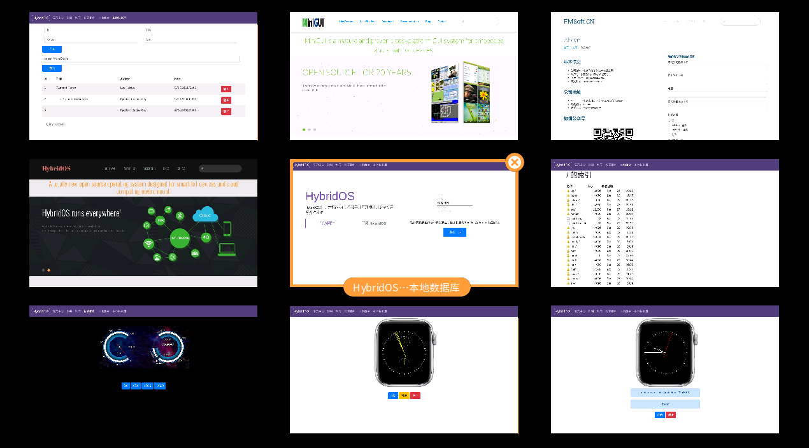

# 合璧操作系统设备端界面外壳的设计

【主题】合璧操作系统设备端界面外壳的设计  
【摘要】本文阐述合璧操作系统设备端界面外壳的设计  
【版本】1.0   
【作者】魏永明  
【日期】2020 年 9 月  
【状态】定稿  

**版权声明**

版权所有 &copy; 2020 北京飞漫软件技术有限公司  
保留所有权利

此文档不受合璧操作系统相关软件开源许可证的管辖。

飞漫软件公开此文档的目标，用于向开发者解释合璧操作系统的设计原理或者相关规范。在未获得飞漫软件书面许可之前，任何人不得复制或者分发本文档的全部或部分内容，或利用本文档描绘的技术思路申请专利、撰写学术论文等。

**目录**

- [应用场景](#应用场景)
- [第一阶段：简单应用场景](#第一阶段简单应用场景)
- [第二阶段：复杂应用场景](#第二阶段复杂应用场景)
- [第三阶段：更完善的复杂应用场景](#第三阶段更完善的复杂应用场景)
- [其他](#其他)
- [附：商标声明](#附商标声明)


## 应用场景

工业控制面板、家用电器的智能控制面板等属于本文所述的单一应用场景。这种应用场景通常具有如下几个特点：

1. 具有较大的屏幕尺寸，通常为横屏。
1. 无图形硬件加速，不需要多媒体支持。
1. 无实体按键，用户使用触摸屏操作，常见操作主要是点击和单指拖拽。
1. 除了输入 WiFi 密码等情形外，极少需要输入法来输入一般文字等。
1. 基本的多任务切换能力。
1. 无需支持第三方应用的下载和安装。
1. 需要提供固件升级功能。

在更多通用场景下，如智能音箱，具备如下几个特点：

1. 完整的输入法支持。
1. 语音交互能力。
1. 需要支持第三方应用的下载和安装。
1. 更为复杂的系统功能访问控制能力。

在合璧操作系统中，使用 MiniGUI 5.0（多进程模式）作为窗口系统，一些系统界面仍使用 C/C++ 开发，而大部分应用使用 hiWebKit/hiACEJS 来渲染其界面。在 GUI 层面，一共有四个进程：

1. MiniGUI 的 `mginit`。该进程扮演窗口管理器运行，使用 C/C++ 开发，包括如下模块：
   1. 定制的合成器（compositor），用于提供主窗口启动、关闭和主窗口展示及前后台切换的特效。
   1. （可选）输入法。
1. MiniGUI 的动态背景进程。该进程动态展示屏幕背景，可展示一个简单的 HybridOS 动画效果。
1. 系统管理进程，拥有较高的系统管理权限，该进程负责创建应用子进程，并创建和维护如下主窗口（称为系统主窗口，system main window）：
   1. 一个用作 Docker 的主窗口，用于呼出主功能（或启动器）、系统设置，使用不同的形式展示应用主窗口等。
   1. 一个用作状态栏（Status Bar）的主窗口，用于展示当前活动主窗口的标题（及图标）、时间以及系统电量等状态。
   1. 锁屏（HybridOS Screen Lock），可在 hiWebKit 支持下运行。
   1. 启动器（HybridOS Launcher），可在 hiWebKit 支持下运行。
   1. 通知（HybridOS Notification），可在 hiWebKit 支持下运行。
1. 应用进程，在 hiWebKit 的支持下运行，使用扩展的 Web 前端技术开发：
   1. 应用进程创建的主窗口称为应用主窗口（app main window）；所有应用主窗口由单个 hiWebKit 进程实例管理，属于同一进程地址空间。
   1. 同一时刻只有一个前台应用主窗口展示在屏幕上（全屏），其他后台的应用主窗口对应的页面，进入节约内存状态。
   1. 后台应用主窗口被唤醒后，恢复页面状态，原来的前台主窗口称为后台应用主窗口，进入节约内存状态。

下图给出了 HybridOS 的应用支持架构：

```
 ---------------------------------------------------------------------------------
| DockerBar, StatusBar,   |                   |           | Input Method Window,  |
| Screen Lock, Launcher,  | App GUI Runners   |  N/A      | System Alert Window,  |        - main windows
| Notification...         |                   |           | ...                   |
 ---------------------------------------------------------------------------------
|      System Manager     |     App Agent     | Wallpaper | mginit w/ compositor  |____    - hiShell
 ---------------------------------------------------------------------------------     |
|                   hiWebKit/hiACEJS          |                                   |    |
 ---------------------------------------------                                    |    |
|  MiniGUI, hiCairo, hiMesa, SQLite, FreeType, HarfBuzz, LibPNG, LibJPEG, ...     |    | hiBus
|                                                                                 |    |
 ---------------------------------------------------------------------------------     |
|                           HybridOS servers and user daemons                     |____|
 ---------------------------------------------------------------------------------
|                          Python runtime environment (optional)                  |
|                             LibZ, CURL, LibGcrypt, ...                          |
|                               C/C++ runtime environment                         |
 ---------------------------------------------------------------------------------
|                               Linux Kernel/Drivers                              |
 ---------------------------------------------------------------------------------
```

根据如下文档的描述：

- [合璧操作系统的应用管理](hybridos-app-management-zh.md)
- [合璧操作系统设备端数据总线概要设计](hybridos-data-bus-zh.md)
- [合璧操作系统设置应用中网络管理行者的设计](hybridos-sysapp-settings-inetd-zh.md)

HybridOS 中其中运行着如下应用：

- 系统应用
   1. `cn.fmsoft.hybridos.hibus`：数据总线服务器应用（hiBus）
   1. `cn.fmsoft.hybridos.settings`：系统设置应用（hiSettings）
   1. `cn.fmsoft.hybridos.appmanager`：用于安装和卸载应用的应用管理器（hiAppManager）
   1. `cn.fmsoft.hybridos.appshell`：应用外壳（hiShell）
      * `mginit`：MiniGUI 的服务器进程
      * `appagent`：一个 GUI 行者，创建 DockerBar、StatusBar，并负责启动和管理应用的生命周期，传递启动数据等。
- 普通应用。其 GUI 行者，可选如下两种引擎之一：
   1. 基于 hiWebKit 扩展 Web 引擎，由 `hiwebkit` 负责渲染。
   1. 基于 hiACEJS 的轻量级应用，由 `hiacejs` 负责渲染。

下图给出了正常运行情况下的界面效果：


上图中，交互要求如下：

- 状态栏在创建新窗口或者设置新的前台主窗口时展开，展示两秒后向上收起。
- 用户点击 Docker Bar 后，Docker 主窗口会向右展开，“向左”图标动态改变方向变成“向左”按钮。此时用户可点击其上的图标来使用其他功能；状态栏会同步向下展开。
- 除向左的收起按钮之外，展开的 Docker Bar 上包含四个功能按钮：主页面（Home）、切换主窗口、系统设置、关机。
- 用户长时间不操作 Docker Bar 时，将自动收起；此时，状态栏同步收起。

进入切换应用主窗口模式时，界面效果类似智能手机：



简单起见，我们做如下处理：

1. 仅展示应用主窗口。
1. 不展示应用图标，取而代之为关闭按钮，点击可关闭对应的主窗口（强制关闭）。

切换应用主窗口时的，交互要求如下：

- 状态栏收起。
- Docker Bar 收起，仅展示“返回”按钮。
- 使用 Cover Flow 效果展示所有应用主窗口内容，用户可左右滑动。
- 点击某个主窗口，将激活该主窗口，系统动画恢复到正常运行情况。
- 点击正面主窗口顶部的“关闭”按钮会强制关闭该主窗口。
- 向上滑动某主窗口，可强制关闭该主窗口（可选）。

以上设计可分阶段完成。

## 第一阶段：简单应用场景

第一阶段（2021 年 1 月前）主要包括：

1. hiShell：
   - MiniGUI 合成器图式下的动态背景渲染进程
   - mginit 进程
   - 支持应用主窗口切换动画效果的合成器
   - 简单 StatusBar，仅显示当前最顶应用主窗口的标题以及系统时间
   - 简单 DockerBar
1. 普通应用：
   - 功能入口页面
   - 若干 hiWebKit 特色功能展示页面
   - 若干 hiWebKit 特色功能展示页面
   - 基于 hiACEJS 的白色家电示例应用

## 第二阶段：复杂应用场景

第二阶段（2021 年 2 月前），新增特性主要包括：

1. hiShell：
   - 启动系统应用，展示系统启动进度动画
   - MiniGUI 合成器图式下的动态背景渲染进程
   - 增强的 StatusBar，显示当前活动主窗口的标题、图标以及系统时间、WiFi 信号强度等信息
   - 增强的 DockerBar
   - 支持应用主窗口启动及关闭的动画效果
1. 系统应用：
   - hiBus：支持 UnixSocket 和 WebSocket 的 hiBus 服务器进程
   - hiSettings：提供 WiFi 热点扫描及连接 WiFi 功能
1. 普通应用：
   - 一个基于 hiACEJS 的白色家电应用
   - 一个基于 hiWebKit 示例智能音箱应用
   - 若干 hiWebKit 特色功能展示页面
   - 访问一般性网站

## 第三阶段：更完善的复杂应用场景

第三阶段（待定）新增特性主要包括：

1. mginit 进程
   - 输入法
1. 应用管理器（hiAppManager）
   - 系统升级
   - 应用的安装及卸载
1. 应用外壳（hiShell）：
1. hiBus：
   - 应用访问权限管理
1. 系统应用：
   - 更多系统设置行者
1. 普通应用：
   - 若干 hiWebKit 特色功能展示页面
   - 访问一般性网站

## 其他

我们还需要完成如下功能特性：

1. 针对不同应用场景的 hiShell 应用外壳，以提供不同的应用生命周期管理策略
1. 应用权限管理

## 附：商标声明

本文提到的产品、技术或者术语名称，涉及北京飞漫软件技术有限公司在中国或其他地区注册的如下商标：

1) 飛漫


2) FMSoft


3) 合璧


4) HybridOS


5) HybridRun


6) MiniGUI


6) xGUI


7) miniStudio


