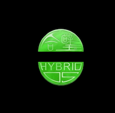
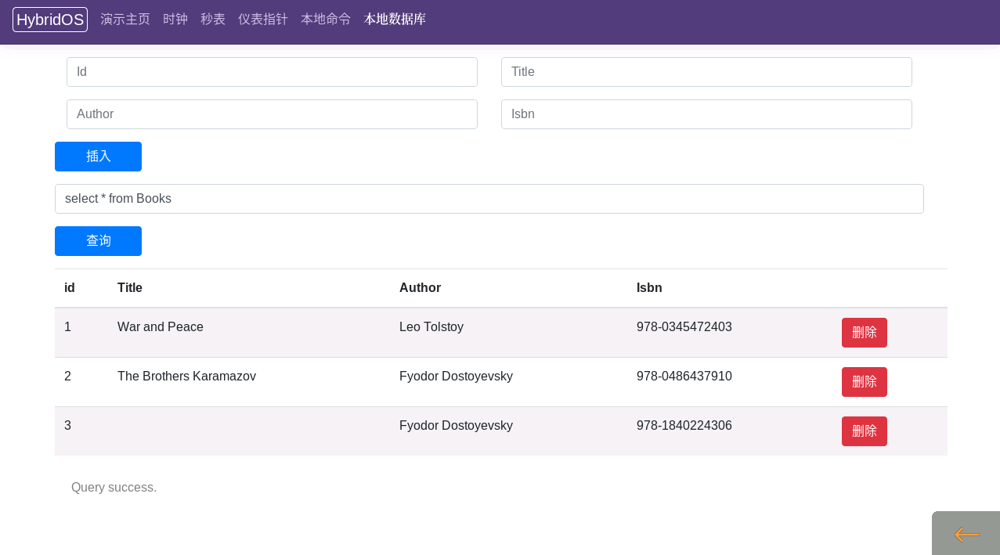
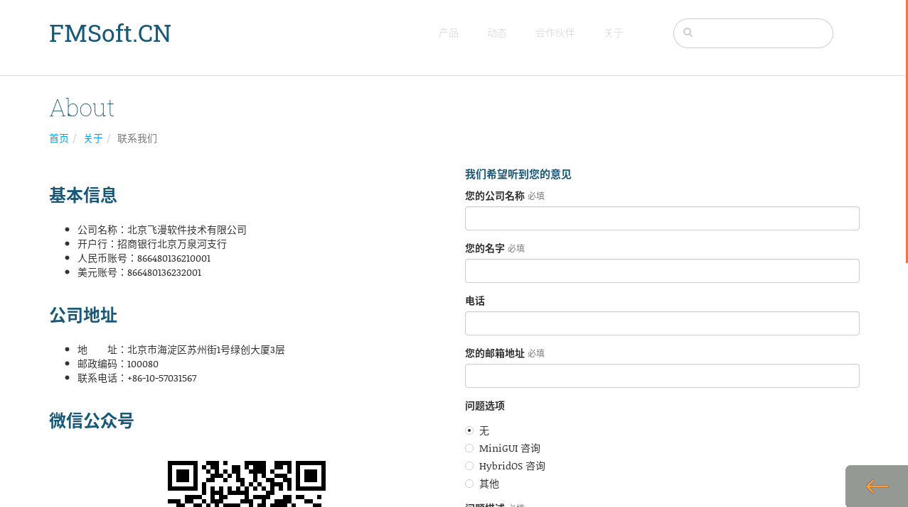

# hiShell Is Released, Code for Device Side of HybridOS Is Almost Complete

After we released hiWebKit, FMSOft’s R&D team immediately began to build an app running environment for the device side of HybridOS, which we called hiShell. After a month of hard work, we officially released the first version of hiShell. We also updated the graphics stack for the device side of HybridOS and hiWebKit component. In addition, along with hiShell, we also released a complete HybridOS App (hiApp for short) source code to demonstrate the extended features we have made on hiWebKit.

Watch the video first:

(video here)  
Run hiApp in hiShell

The design idea of the software architecture on the device side of HybridOS is called data-driven. The benefits of this design idea are obvious:

1. It is the most reasonable software design idea to use the most suitable programming language and APIs to develop different functional modules in the system, that is, using the most suitable tools to complete the specific work. For example, to develop GUIs, based on hiWebKit's extended tags and functions, combined with HTML5, CSS3, and JavaScript, it is very easy to develop a graphical user interface with rich interaction effects and excellent display capabilities. For computationally intensive task modules, we can use C/C++ language (or Python language) to implement them. Finally, modules developed in different programming languages are connected through a local data bus.
1. Data-driven software architecture design also facilitates decoupling between functional modules, which greatly facilitates development, testing, and debugging. For example, when we develop a GUI on a desktop computer, we can write a low-level module that simulates various situations in the real environment. This module can generate various possible data for the GUI module, thereby forming an interactive situation that can cover all test cases for GUI modules. In this way, most of the debugging work can be completed in the development phase, without the need to do full coverage testing on real hardware.

The following figure shows the software architecture for the device side of HybridOS:

  
The software architecture for the device side of HybridOS

The hiShell version 1.0 released this time mainly implements the following modules:

1) The server process of MiniGUI. This process runs as a window manager, developed in C/C++, and includes a customized window compositor, which provides the main window switching function and animation effects when switching.

  
The customized window compositor, which provides the main window switching function and animation effects when switching

2) Live wallpaper process. The process showes a live wallpaper, an animation of the Chinese and English logos of HybridOS.

  
Live wallpaper

3) System management process. This process is responsible for creating and maintaining the following main windows (called the system main windows):
   - Status Bar, used to display the title, time and other information of the currently active main window.
   - Docker Bar, used to call out the main function (or launcher), system settings, select and switch the main application window, etc.

  
Status bar, used to display the title of current window and the system time

  
Docker bar, used to launch various hiApps.

4) App process, called appagent. This process runs under the support of hiWebKit and is used to manage app windows and render hiApps developed based on the extended Web front-end technology in the windows. This version provides the following app entries as examples:
   - The five function entrances used to show the extended features of hiWebKit, which show the scroll wheel, custom view tags (clock and stopwatch), meter, use of LCMD schema, use of LSQL schema, and so on.
   - The entry for a simple system settings.
   - The entry to visit the official website of HybridOS (<https://hybridos.fmsoft.cn>).

The screenshots of each example are as follows:

  
The main entrance of the demo

  
Clock

  
Stopwatch

  
Meters with needle pointer or strip pointer

  
Using LCMD schema to travel locale file system

  
Using LSQL schema to operate local SQLite database

  
System settings

  
About HybridOS (visiting Web pages on Internet)

It should be noted that the icons and their functions on the hiShell docker bar can be modified through a runtime configuration file. You only need to use the extended Web tags, protocols and HTML 5/CSS 3/JavaScript to develop your own hiApp and modify this configuration file to complete the corresponding deployment.

To fetch and build the code of HybridOS Device Side, please visit:

<https://github.com/FMSoftCN/hybridos/tree/master/device-side>

In the next fourth quarter of 2020, the HybridOS team will complete the development of the remaining components of HybridOS Device Side, including:

1. hiBusServer, the local data bus server. Through this server, we can obtain system status change information (such as battery level, WiFi signal strength, etc.) in your hiApps, and can also complete certain system functions by sending task requests, such as connecting to a designated WiFi hotspot.
1. hiWSServer, the local WebSocket server. The service runs locally and provides WebSocket services for hiApps. Essentially, it runs as a proxy for the hiBus server, so that you can call system functions without developing JavaScript local binding objects.
1. A complete device-side software stack, component system (including cross-compilation), documentation and sample codes of the integrated operating system.

We plan to officially release HybridOS Device Side version 1.0 in December 2020. This exciting and innovative product will be available to everyone for product development in three months!

Remember, HybridOS follows the "open source and open process" principle, **release means you can see the source code at the same time**. In fact, the source code of HybridOS is mirrored on GitHub in real time.

**To support HybridOS, please visit the HybridOS repository on GitHub, and light up the star of the HybridOS project on GitHub!**

<https://github.com/FMSoftCN/hybridos>
