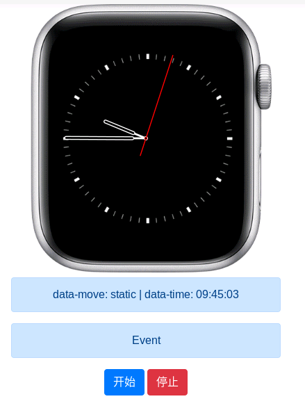
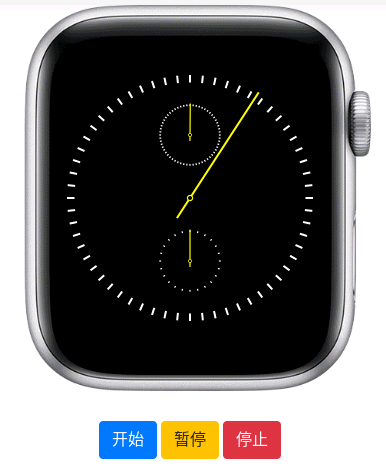
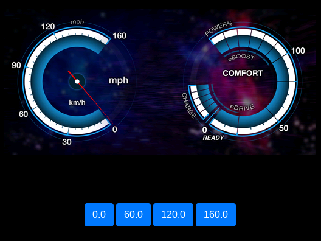
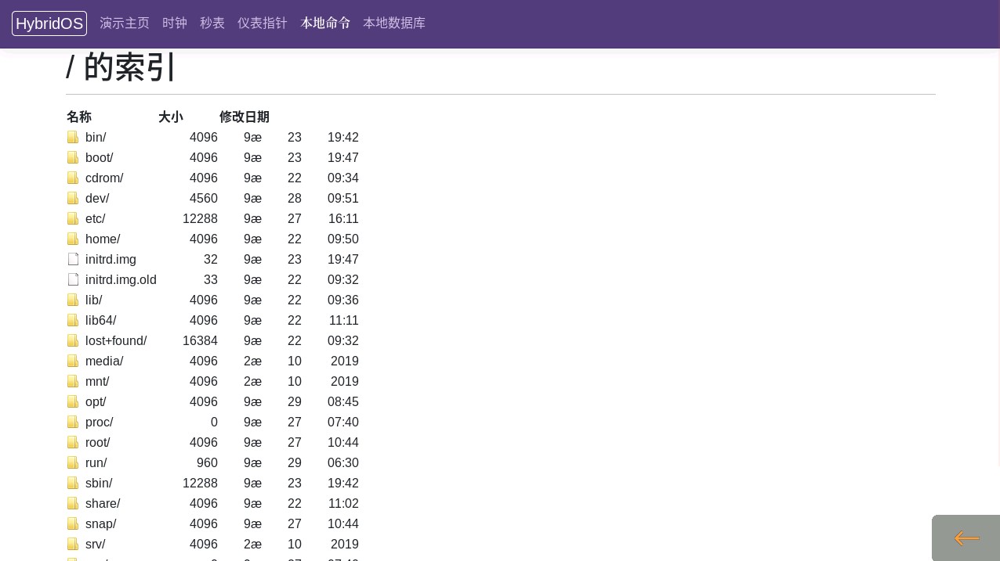
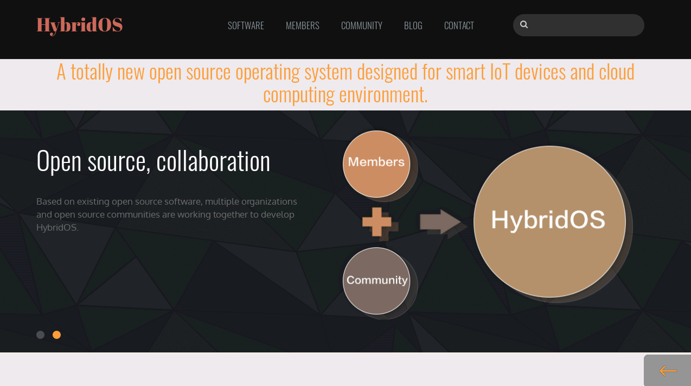

# 合璧操作系统设备侧代码接近完成：hiShell 发布

魏永明

在我们发布了 hiWebKit 之后，飞漫的研发团队立即开始着手构建合璧操作系统（HybridOS）设备侧的应用运行环境，我们称之为 hiShell。经过两个月的奋战，hiShell 正式发布。我们同时发布了一个完整的 HybridOS App（简称 hiApp）源代码代码，用于展示我们在 hiWebKit 上所做的诸多扩展特性。

先看视频：

（插入视频）  
在 hiShell 环境以及在 hiWebKit 支持下运行 hiApp

如[《低代码：合璧操作系统设备侧的软件架构》](https://mp.weixin.qq.com/s?__biz=MzA5MTYwNTA3MA==&mid=2651104663&idx=2&sn=4883ea4ec7ba7a77a9557a41a94da5d4)一文中所描述，合璧操作系统设备侧软件架构之设计思想，我们称之为数据驱动。这种设计思想带来的好处非常明显：

1. 使用最合适的编程语言和工具来开发系统中不同的功能模块是最为合理的软件设计思想，也就是说，用最合适的工具来完成最合适的工作。比如，要开发 GUI，基于 hiWebKit 的扩展标签和功能，结合 HTML 5/CSS 3/JavaScript 就可以轻松开发具有丰富交互效果和优秀展示能力的图形用户界面。而对于计算密集型的任务模块，则可使用 C/C++ 语言（或者 Python 语言）来实现。最后，使用不同编程语言开发的模块之间，通过本地的数据总线连接起来。
1. 数据驱动的软件架构设计，还有利于功能模块之间的解耦，从而大大方便开发、测试和调试。比如，当我们在台式电脑上开发 GUI 时，我们可以编写一个模拟真实环境各种情况的底层模块，这个模块可以产生各种可能的数据给 GUI 模块，从而形成可以覆盖所有 GUI 模块交互情形的测试用例。这样，就可以将绝大部分调试工作在开发阶段完成，而不需要在真实硬件上做全覆盖测试。

下图给出了合璧操作系统设备侧的软件架构。

  
合璧操作系统设备侧的软件架构

本次发布的 hiShell 1.0 版本，主要实现了如下模块：

1) MiniGUI 的服务器进程。该进程扮演窗口管理器运行，使用 C/C++ 开发，包含一个定制的窗口合成器（compositor），用于提供主窗口切换功能以及切换时的动画特效。

  
定制窗口合成器，提供了常见于现代智能设备的窗口切换功能和动画特效

2) 动态壁纸进程。该进程展示了一个动态壁纸，即合璧中英文徽标的合并动画。

  
动态壁纸

3) 系统管理进程，该进程负责创建和维护如下主窗口（称为系统主窗口，system main window）：
   - 状态栏（Status Bar），用于展示当前活动主窗口的标题、时间等信息。
   - 任务栏（Docker Bar），用于呼出主功能（或启动器）、系统设置，选择和切换应用主窗口等。

  
状态栏，用于展示当前窗口标题以及时间

  
任务栏，用于启动 hiApp 以及系统设置等功能

4) 应用进程，称为 appagent，该进程在 hiWebKit 的支持下运行，用于管理应用窗口，并在窗口中渲染基于扩展 Web 前端技术开发的 hiApp 应用。本版本提供了如下几个应用入口作为示例：
   - 用于展示 hiWebKit 扩展特性的五个功能入口，其展示了滚轮、自定义控件标签（时钟和秒表）、仪表指针、使用 LCMD 协议直接读取文件系统内容、使用 LSQL 协议直接操作本地数据库等功能。
   - 一个简单的系统设置功能入口。
   - 一个访问合璧操作系统官方网站（<https://hybridos.fmsoft.cn>）的入口。

各应用示例的截屏如下：

  
演示功能主入口

  
时钟表盘

  
秒表

  
指针式仪表盘或条带式仪表盘

  
使用 LCMD 协议直接读取文件系统内容

  
使用 LSQL 协议直接操作本地数据库

  
系统设置

  
关于（访问互联网 Web 页面）

需要说明的是，hiShell 任务栏上的图标及其功能可以通过配置文件修改。您只要使用扩展的 Web 标签、协议以及 HTML 5/CSS 3/JavaScript 开发好自己的 hiApp，修改这个配置文件即可完成相应的部署。

有关合璧操作系统设备侧代码的获取及其构建方法，敬请访问：

<https://github.com/FMSoftCN/hybridos/tree/master/device-side>

在接下来的 2020 年第四季度，飞漫开发团队将完成合璧操作系统设备侧 1.0 版本剩余的组件开发，主要有：

1. hiBusServer 本地数据总线服务器。通过该服务器，我们可以在应用中获得系统状态的变化信息（如电量、WiFi 信号强度等），还可以通过发送任务请求来完成某些系统功能，如连接到指定的 WiFi 热点。
1. hiWSServer：本地 WebSocket 服务器。该服务运行在本地，为基于 hiWebKit 的页面提供 WebSocket 服务，本质上作为 hiBus 服务器的代理运行，从而无需开发 JavaScript 的本地绑定对象，即可实现对系统功能的调用。
1. 完整的合璧操作系统设备侧软件栈、构件系统（含交叉编译）、文档和示例代码。

我们计划在 2020 年 12 月正式发布 HybridOS Device Side 1.0。这令人激动的创新产品，再过三个月，大家就可以用于产品开发了！

记住，HybridOS 遵循过程开源原则，**发布即意味着您可以同时看到源代码**。实际上，HybridOS 的源代码是实时镜像到 GitHub 上的。

**点击文末原文链接，支持合璧操作系统，请点亮 GitHub 上 HybridOS 项目的星星吧！**

---

原文链接：<https://github.com/FMSoftCN/hybridos>

